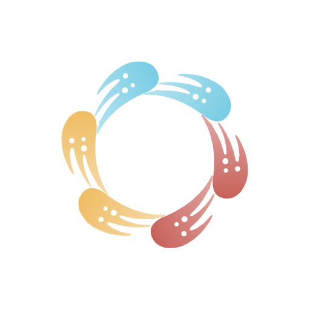

<p align="center">
  
</p>

<h1 align="center">Revelica Skills</h1>

Official Revelica plugin for AI agents. Connects an agent to a Revelica product
workspace — customer research, competitive analysis, user story maps, goals, bets,
and the specs that come out of them — and bundles Revelica's own product skills.
Follows the [Agent Skills open standard](https://agentskills.io/specification),
compatible with Claude Code, Cowork, Cursor, Gemini CLI, OpenAI Codex, and more.

## Repository Structure

```
revelica/skills
├── .claude-plugin/
│   ├── marketplace.json         # Claude Code marketplace catalog
│   ├── plugin.json              # Claude Code plugin manifest
│   └── mcp.json                 # MCP config for Claude Code plugin
├── .cursor-plugin/
│   └── plugin.json              # Cursor plugin manifest
├── skills/                      # Skill definitions (Agent Skills open standard)
│   ├── product-for-coding-agents/  # Product layer for coding agents (orientation)
│   └── write-spec/              # Author a feature spec attached to an idea
├── assets/                      # Brand icons (README, directory submissions)
├── server.json                  # MCP registry manifest (registry.modelcontextprotocol.io)
├── .mcp.json                    # MCP config for Cursor/Gemini
├── gemini-extension.json        # Gemini CLI extension manifest
└── LICENSE                      # Apache-2.0
```

## Installation by Platform

### Claude Code

```
/plugin marketplace add revelica/skills
/plugin install revelica@revelica
```

Skills are **model-invoked** — Claude automatically uses them based on context. The MCP
server is registered automatically.

### Cowork

Add `https://api.revelica.com/mcp` as a custom connector in your organization's
settings. Skills come with the plugin once it is listed in the plugin directory.

### Cursor

Install via the `.cursor-plugin/plugin.json` manifest. Cursor will discover skills from
the `skills/` directory and connect to the MCP server via `.mcp.json` automatically.

### Gemini CLI

```
gemini extensions install revelica/skills
```

The `gemini-extension.json` manifest registers both skills and the MCP server.

## Available MCP Tools

These tools are provided by the Revelica MCP server and callable from any skill:

| Tool | Description |
|------|-------------|
| `query` | Search or filter the workspace by criteria. Returns ranked matches, plus the schema template when `artifact_type` is set. |
| `read` | Read a single artifact or entity in full by id, or navigate to a subtree with a dotted field `path`. |
| `create` | Create new artifacts or entities. Content validated against registered schemas. |
| `update` | Apply partial field-level updates via dot-path notation. |
| `load_skill` | Load a skill's instructions and prefetched workspace data. |
| `list_skills` | List the skills this workspace exposes to MCP clients. |

All tools require OAuth authentication and enforce Supabase RLS — users only see their
own workspace's data.

## Available Skills

| Skill | Description |
|-------|-------------|
| `product-for-coding-agents` | Orientation for a coding agent: read the idea/spec/UX behind the code, write high-level results (impl docs, PRs, tested feasibility assumptions, ideas, sources) back. |
| `write-spec` | Author a feature spec attached to an idea, following the Revelica spec template — incremental section-by-section writes that fit coding-agent tool-call budgets. |

## Adding a New Skill

1. Create a folder under `skills/`:
   ```bash
   mkdir skills/my-skill
   touch skills/my-skill/SKILL.md
   ```

2. Write `SKILL.md` following the [Agent Skills spec](https://agentskills.io/specification):
   ```markdown
   ---
   name: my-skill
   description: What this skill does and when to use it.
   compatibility: Requires Revelica MCP server (query, read, create, update tools)
   ---

   Instructions for the agent...
   ```

3. Commit and push. Users get the update by running:
   ```
   /plugin update revelica@revelica
   ```

No backend changes needed unless the skill requires a new MCP tool.

## Connecting the MCP Server Directly

If you'd rather connect the server without the plugin, add it as a remote MCP
server / custom connector:

| | |
|---|---|
| **Server URL** | `https://api.revelica.com/mcp` |
| **Transport** | Streamable HTTP |
| **Authentication** | OAuth 2.0 with dynamic client registration — no API key to manage |
| **Prerequisite** | A Revelica workspace ([sign up](https://app.revelica.com)) |

Server metadata is published at
[`/.well-known/mcp/server-card.json`](https://api.revelica.com/.well-known/mcp/server-card.json).

## Privacy Policy

Revelica's privacy policy — covering what data is collected, how it is used and
stored, third-party sharing, retention, and how to contact us — is published at
[revelica.com/privacy](https://revelica.com/privacy). Terms of service are at
[revelica.com/terms](https://revelica.com/terms).

The MCP server reads and writes only the product data in your own Revelica
workspace. Every request is authenticated with OAuth and enforced by Supabase
row-level security, so a connected agent can never see another workspace's data.
The server does not query your chat history, conversation summaries, or files.

## Support

- **Issues with the plugin or skills:** [open a GitHub issue](https://github.com/revelica/skills/issues)
- **Account, workspace, or MCP server issues:** ask@revelica.com

## License

[Apache-2.0](LICENSE) © Revelica

# About Revelica

Revelica is an AI-native product discovery platform. It helps product teams gather customer insights, perform competitive analysis, and experimentally validate ideas that feed into their AI development workflow.

🔗 Homepage with free Pro trial: https://revelica.com

🔗 Template library with playbooks, skills, and insight templates: https://revelica.com/templates

🔗 Free AI tools with no signup required: https://revelica.com/tools
